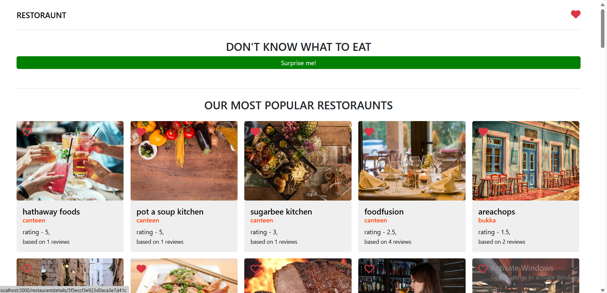

# Restaurant App

Restaurant App is a document that is not open-source it's a challenge on Brainster Academy and with this app we can see the top 10 popular restaurants by rating we can chose a favorite restaurant we can open and see the details on the specific restaurant by our choice and we can leave review with name,comment,and rating stars. Also on home page we can filter the restaurants by restaurantType and on the last section on home page we have all the restoraunts.
For this app is used React, Bootstrap, Css, Typescript.

# Installation

## Clone this Repository

git clone https://github.com/DarioPetkovski/TopProjects-BrainsterAcademy/tree/Restaurant-App

## Install Dependencies

npm install

## Run App

npm run start

## Run Local Server

npm run server

# Demo Show

**Click to play the Demo Gif**

